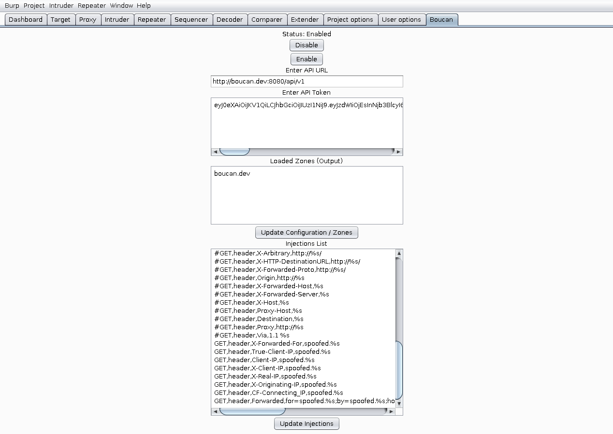
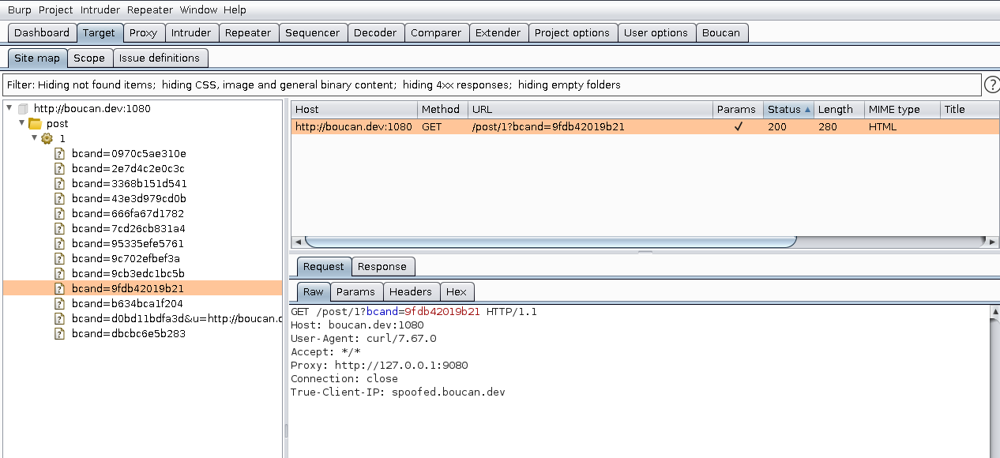

# Burp Extension

This folder containst the Burp Extension. The Burp Extension is written in Jython and is meant to inject payloads and communicate with the API

More documentation can be found here: [Boucan: A Bug Bounty Canary Platform](https://github.com/3lpsy/boucanpy)

## About the Extension

This extension is similar to Burp Collaborator. It assumes you have a Boucan Server and its associated URL and API Token. Once configured with the proper settings, the extension will pull the related zones (domains) which will be injected into requests that are in scope and pass through the HTTP Proxy.

### Requirements

The extension requires a working jython environment but will work on both the community and pro versions of Burp.

### Note on Safety

This extension is more dangerous than Burp Collaborator because it will make a separate request for each in scope request to come through the proxy. When setting injection types, you should be careful about which methods you use. For example, the following injections are **relatively** safe:

```
GET,header,Client-IP,spoofed.%s
GET,header,X-Client-IP,spoofed.%s
GET,header,X-Real-IP,spoofed.%s
```

However, injections that target POST requests (or other methods that update data) may be dangerous as the extension will submit a new request for each injection. Consider the extension more of a scanner than other passive extensions.

### Tracking Requests

Unfortunately, to my knowledge, you cannot update the Proxy History from a Burp Extension. Therefore, I've added a specific param for each injection that is appended to the URL. This is called the "beacon" and will allow the request to be unique enough to show up in the site map.

### Improvements

There's a lot of room for improvement, especially in performance and UI. PRs are welcome!

### Sample Target

There's a sample vulnerable target that will proxy requests for a given zone via the "Proxy" header. It can be found here: [Boucan Target](https://github.com/3lpsy/boucan-target)

### Tab



### SiteMap


